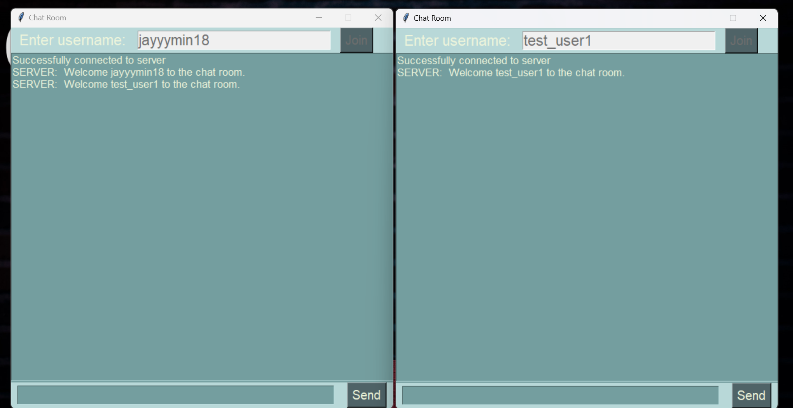
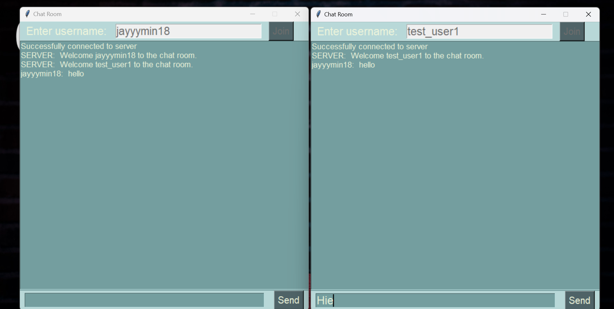
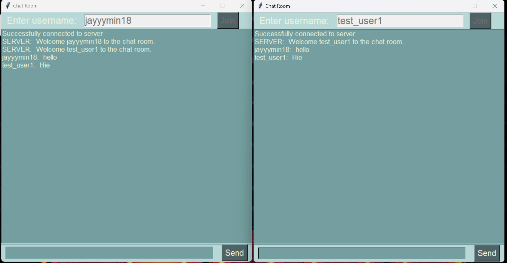

# Real-Time-Chat-App
A real time chat application, created using tkinter module and socket programming

### Usage
Start by running the server side script by opening command prompt at project root directory and type
```
python server.py
```
Once the server is up and running, create a client by running client script, which is done by typing
```
python client.py
```
Some more screnshots which suggests the working of the application



